# Architecture Diagrams

---

## 1. Module Dependencies

Shows which layers depend on which other layers (inward dependency rule).

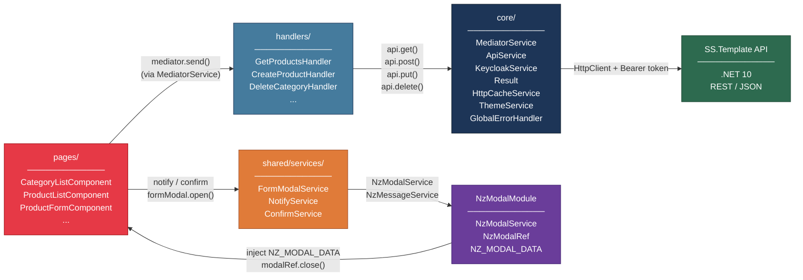

> **Note:** `NzModalModule` is registered globally via `importProvidersFrom(NzModalModule)` in `app.config.ts`.
> `NzModalService` is NOT `providedIn: 'root'` — feature components never inject it directly. They use `FormModalService` and `ConfirmService` instead.

---

## 2. Application Initialization Flow

How the app bootstraps before rendering — Keycloak must succeed before any component renders.

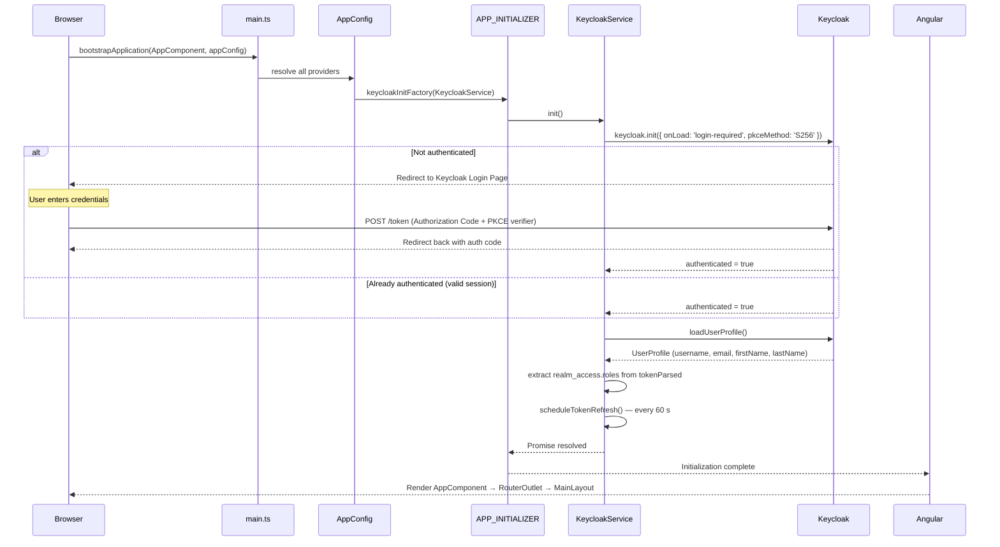

---

## 3. CQRS Command Flow (Write Operation)

Full flow of a create/update action from UI to API and back. Forms open as modal dialogs — not as routed pages.

```mermaid
sequenceDiagram
    participant User
    participant List as List/Detail Component
    participant FMS as FormModalService
    participant Modal as NzModalService
    participant Form as FormComponent (modal content)
    participant Mediator as MediatorService
    participant Handler as CommandHandler
    participant Interceptors as HTTP Interceptors
    participant API as SS.Template API
    participant Notify as NotifyService

    User->>List: Click "New" / "Edit" button (guarded by canCreate)
    List->>FMS: formModal.open(() => import(FormComponent), { title, data: { id? } })
    FMS->>Modal: modal.create({ nzContent: FormComponent, nzData, nzOnCancel... })
    Modal->>Form: instantiate component, inject NzModalRef + NZ_MODAL_DATA
    Form->>Form: ngOnInit() — load data if id present (edit mode)

    User->>Form: Fill fields and click Create / Update
    Form->>Form: Validate FormGroup (Reactive Forms + CustomValidators)

    alt Form invalid
        Form-->>User: Show validation errors (nzHasFeedback)
    else Form valid
        Form->>Form: submitting.set(true)
        Form->>Mediator: send(new CreateProductCommand(payload), CreateProductHandler)
        Mediator->>Handler: injector.get(CreateProductHandler).handle(command)
        Handler->>Interceptors: api.post('/products', payload)

        rect rgb(30, 50, 80)
            Note over Interceptors: Interceptor chain
            Interceptors->>Interceptors: loadingInterceptor — loading.start()
            Interceptors->>Interceptors: correlationIdInterceptor — attach X-Correlation-ID
            Interceptors->>Interceptors: authInterceptor — refreshToken() → attach Bearer
            Interceptors->>API: POST /api/v1/products { name, price, categoryId }
        end

        alt API success (201)
            API-->>Interceptors: { id: "guid" }
            Interceptors-->>Handler: HttpResponse
            Handler-->>Mediator: Result.success("new-guid")
            Mediator-->>Form: Observable<Result<string>>
            Form->>Form: result.match(onSuccess, _)
            Form->>Notify: notify.created('Product')
            Form->>Modal: modalRef.close(true)
            Modal-->>FMS: afterClose emits true
            FMS-->>List: Observable<boolean> emits true
            List->>List: loadProducts() — reload table
        else API error (400/409/500)
            API-->>Interceptors: ProblemDetails
            Interceptors->>Interceptors: errorInterceptor — show NzMessage error
            Interceptors-->>Handler: Result.failure(AppError)
            Handler-->>Form: Observable<Result<string>>
            Form->>Notify: notify.error(err)
            Form-->>User: Error toast shown, modal stays open
        end

        Form->>Form: submitting.set(false)
    end
```

---

## 4. CQRS Query Flow (Read Operation)

Flow of a paginated read request from component initialization to table render.

```mermaid
sequenceDiagram
    participant Page as ProductListComponent
    participant Mediator as MediatorService
    participant Handler as GetProductsHandler
    participant Interceptors as HTTP Interceptors
    participant API as SS.Template API

    Page->>Page: ngOnInit()
    Page->>Page: loading.set(true)
    Page->>Mediator: send(new GetProductsQuery({ page: 1, pageSize: 10 }), GetProductsHandler)
    Mediator->>Handler: injector.get(GetProductsHandler).handle(query)
    Handler->>Interceptors: api.get('/products', { page: 1, pageSize: 10 })

    rect rgb(30, 50, 80)
        Note over Interceptors: Interceptor chain
        Interceptors->>Interceptors: correlationIdInterceptor — attach X-Correlation-ID
        Interceptors->>Interceptors: authInterceptor — refreshToken() → attach Bearer
        Interceptors->>API: GET /api/v1/products?page=1&pageSize=10
    end

    API-->>Interceptors: 200 { items: [...], totalCount: 42, page: 1, ... }
    Interceptors-->>Handler: HttpResponse
    Handler-->>Mediator: Result.success(PagedResponse<ProductDto>)
    Mediator-->>Page: Observable<Result<PagedResponse<ProductDto>>>

    Page->>Page: result.match(data => pagedData.set(data), err => notify.error(err))
    Page->>Page: loading.set(false)
    Page-->>Page: nz-table renders with pagedData().items
    Page-->>Page: pagination shows pagedData().totalCount
    Page->>Page: _syncToUrl() — updates query params (page, search, filters, sort)
```

---

## 5. Authentication Guard Flow

How route guards protect pages. Create/edit forms are no longer routed — they open as modals with button-level `canCreate` / `canDelete` checks.

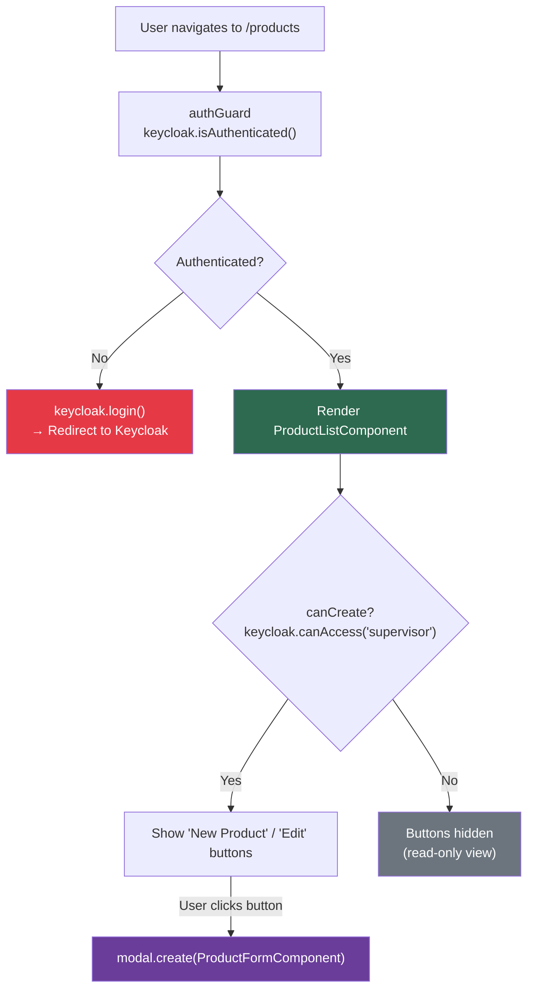

> **Note:** `/products/new` and `/products/:id/edit` routes do not exist. Form access is gated entirely at the component level via `canCreate` (a computed signal from `keycloak.canAccess('supervisor')`). Modals are opened via `FormModalService`, never via `NzModalService` directly.

---

## 6. Vertical Slice Structure

How each entity feature is organized as a self-contained slice. Form components are modal content — they are opened by list and detail components via `NzModalService`.

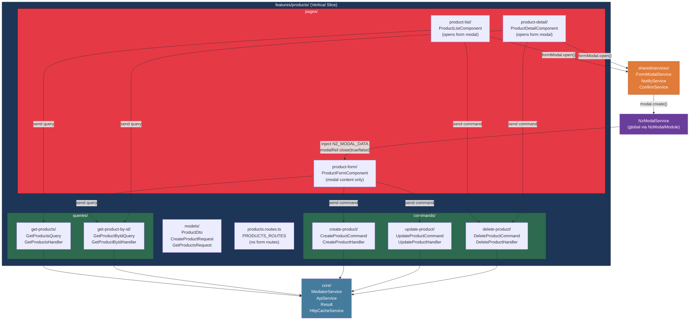

---

## 7. HTTP Interceptor Pipeline

How interceptors wrap every outgoing HTTP request. Interceptors execute in registration order (defined in `app.config.ts`).

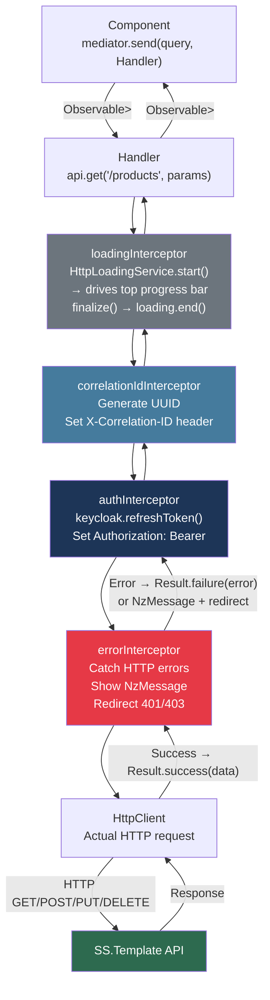

---

## 8. Modal Form Lifecycle

How a list/detail component opens, communicates with, and reacts to a form modal — including the dirty-check confirm dialog.

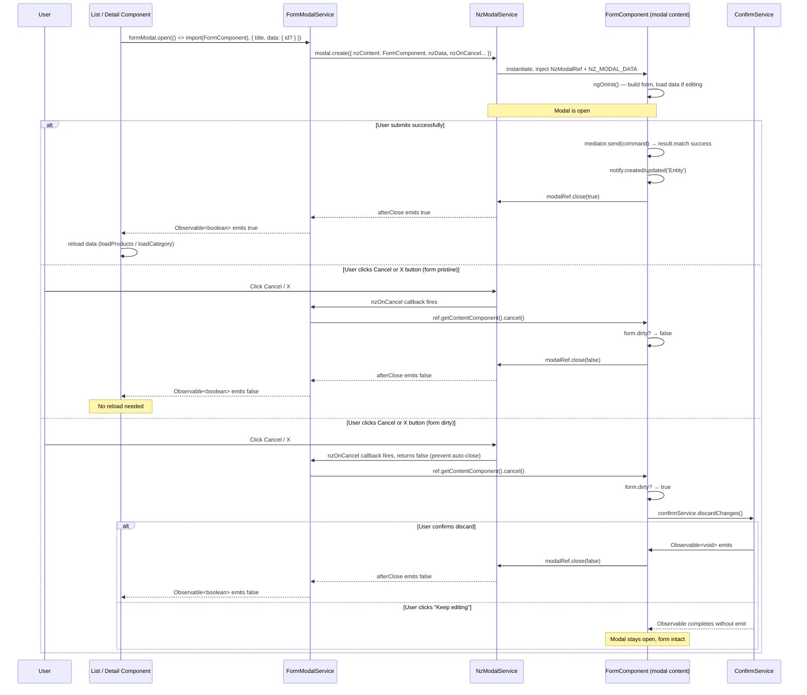

---

## 9. URL State Persistence (List Pages)

How list components sync filter, pagination, and sort state to the browser URL — enabling back-button navigation and shareable links.

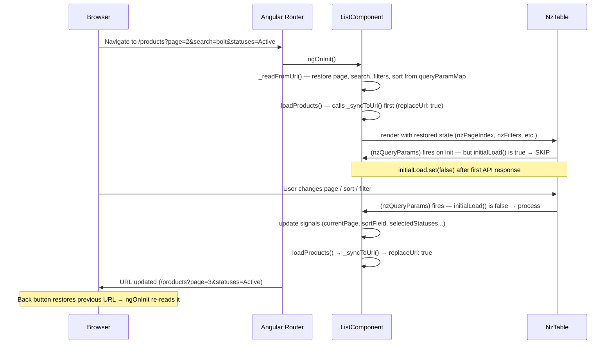

---

## 10. HTTP Cache Flow (Stable GET Responses)

How `HttpCacheService` avoids repeated API calls for stable reference data (e.g. category dropdowns).

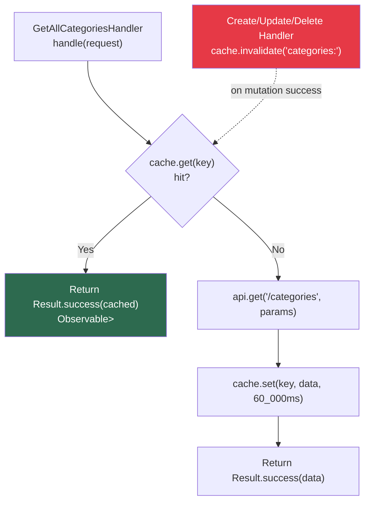

> Cache is only applied when fetching large page sizes (≥ 50) with no search/filter/sort — i.e. the full reference list used to populate dropdowns. Regular paginated table queries always hit the API.

---

## 11. Theme Toggle (Dark Mode)

How `ThemeService` manages light/dark mode across the application.

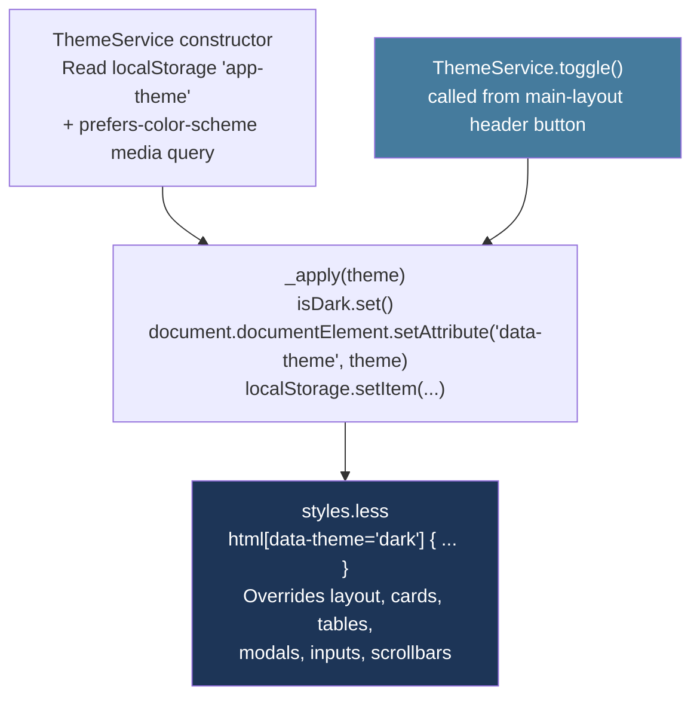
